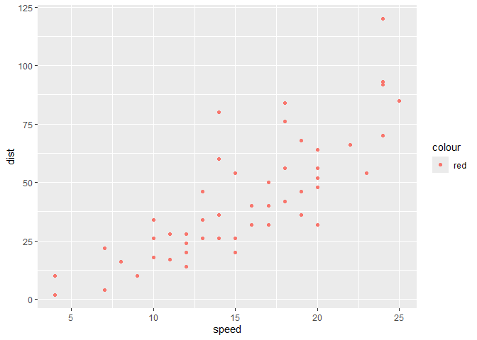
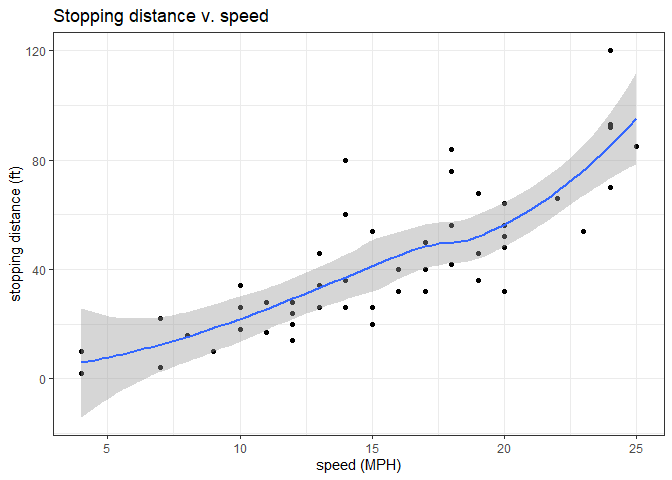
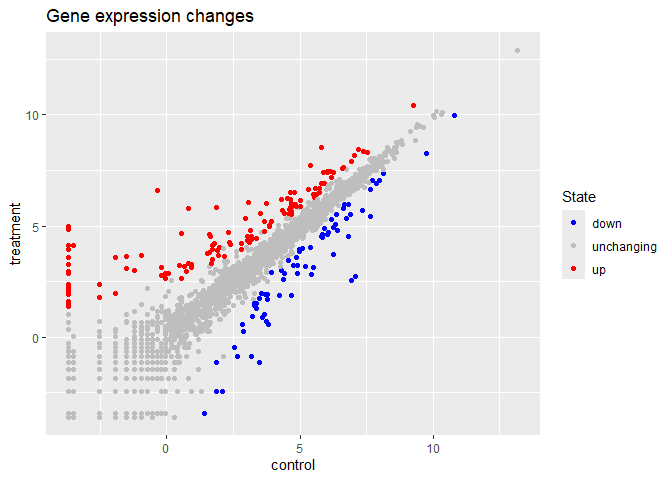
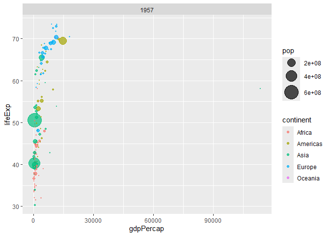

# Class 05: Data Visualization with GGPLOT
Michael Preston

``` r
# install.packages("ggplot2)
```

Plot cars dataset

``` r
library(ggplot2)
ggplot(cars)
```


``` r
ggplot(cars) + aes(speed, dist)
```


``` r
ggplot(cars) + aes(speed, dist) + geom_point()
```


``` r
ggplot(cars, aes(speed, dist, col='red')) + geom_point()
```



``` r
ggplot(cars) + 
  aes(speed, dist) + 
  geom_point() + 
  geom_smooth() + 
  labs(title='Stopping distance v. speed',
       x='speed (MPH)',
       y='stopping distance (ft)')+ 
  theme_bw()
```

    `geom_smooth()` using method = 'loess' and formula = 'y ~ x'



Plot Gene expression dataset

``` r
url <- "https://bioboot.github.io/bimm143_S20/class-material/up_down_expression.txt"
genes <- read.delim(url)
head(genes)
```

            Gene Condition1 Condition2      State
    1      A4GNT -3.6808610 -3.4401355 unchanging
    2       AAAS  4.5479580  4.3864126 unchanging
    3      AASDH  3.7190695  3.4787276 unchanging
    4       AATF  5.0784720  5.0151916 unchanging
    5       AATK  0.4711421  0.5598642 unchanging
    6 AB015752.4 -3.6808610 -3.5921390 unchanging

``` r
nrow(genes)
```

    [1] 5196

``` r
colnames(genes)
```

    [1] "Gene"       "Condition1" "Condition2" "State"     

``` r
ncol(genes)
```

    [1] 4

``` r
table(genes['State'])
```

    State
          down unchanging         up 
            72       4997        127 

``` r
127 / nrow(genes) *100
```

    [1] 2.444188

``` r
ggplot(genes) +
  aes(Condition1, Condition2) +
  geom_point()
```


``` r
ggplot(genes) +
  aes(Condition1, Condition2, col=State) +
  geom_point()
```


``` r
p <- ggplot(genes) +
  aes(Condition1, Condition2, col=State) +
  geom_point() +
  scale_color_manual(values=c("blue", "gray", "red"))
p
```


``` r
p + labs(title='Gene expression changes',
         y='treatment',
         x='control')
```



``` r
# File location online
url <- "https://raw.githubusercontent.com/jennybc/gapminder/master/inst/extdata/gapminder.tsv"

gapminder <- read.delim(url)
```

``` r
# install.packages("dplyr")
library(dplyr)
```


    Attaching package: 'dplyr'

    The following objects are masked from 'package:stats':

        filter, lag

    The following objects are masked from 'package:base':

        intersect, setdiff, setequal, union

``` r
gapminder_2007 <- gapminder %>% filter(year==2007)
```

``` r
ggplot(gapminder_2007) +
  aes(x=gdpPercap, 
      y=lifeExp,
      col=continent,
      size=pop) +
  geom_point(alpha=0.5)
```


Repeat for 1957

``` r
gapminder_1957 <- gapminder %>% filter(year==1957)

ggplot(gapminder_1957) +
  geom_point(aes(x=gdpPercap, 
      y=lifeExp,
      col=continent,
      size=pop),
      alpha=0.7) +
  scale_size_area(max_size=10) +
  facet_wrap(~year)
```


