# Lab 7: Machine Learning 1
Michael Preston (PID: A53310268)

# Machine learning

This document will explore some “classical” machine learning approaches.

## Intro with simulated data

### Clustering

First, we’ll cluster some simulated data

``` r
sim_data <- rnorm(n=100, mean=0, sd=1)
hist(sim_data)
```

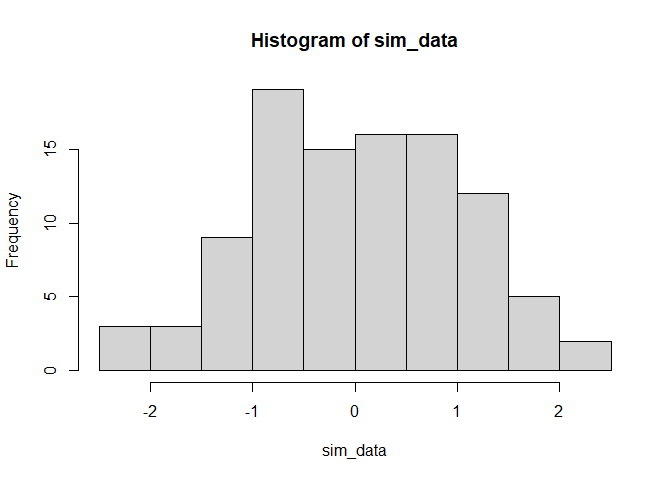

``` r
# sim 30 values centered on -3
data_0 <- rnorm(n=30, mean=-3, sd=1)

# sim 30 values centered on 3
data_1 <- rnorm(n=30, mean=3, sd=1)

# join
x <- c(data_0, data_1)

# sim y
y <- rev(x)

# create table
data <- cbind(x, y)

# plot
plot(data)
```

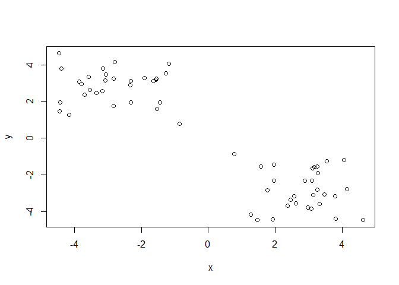

Now apply k-means

``` r
k <- kmeans(data, centers=2)
k
```

    K-means clustering with 2 clusters of sizes 30, 30

    Cluster means:
              x         y
    1 -2.815483  2.825636
    2  2.825636 -2.815483

    Clustering vector:
     [1] 1 1 1 1 1 1 1 1 1 1 1 1 1 1 1 1 1 1 1 1 1 1 1 1 1 1 1 1 1 1 2 2 2 2 2 2 2 2
    [39] 2 2 2 2 2 2 2 2 2 2 2 2 2 2 2 2 2 2 2 2 2 2

    Within cluster sum of squares by cluster:
    [1] 59.70656 59.70656
     (between_SS / total_SS =  88.9 %)

    Available components:

    [1] "cluster"      "centers"      "totss"        "withinss"     "tot.withinss"
    [6] "betweenss"    "size"         "iter"         "ifault"      

Q. How big are the clusters

``` r
k$size
```

    [1] 30 30

Q. To what cluster do my data point belong?

``` r
k$cluster
```

     [1] 1 1 1 1 1 1 1 1 1 1 1 1 1 1 1 1 1 1 1 1 1 1 1 1 1 1 1 1 1 1 2 2 2 2 2 2 2 2
    [39] 2 2 2 2 2 2 2 2 2 2 2 2 2 2 2 2 2 2 2 2 2 2

Q. Make a plot colored by cluster assignment

``` r
plot(data, col=k$cluster)
points(k$centers, col='blue', pch=15)
```

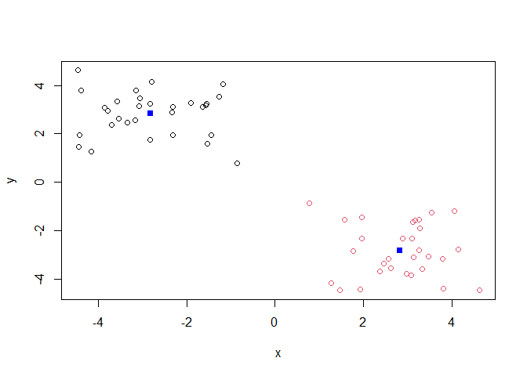

repeat, but with 4 clusters

``` r
k4 <- kmeans(data, centers=4)
plot(data, col=k$cluster)
points(k4$centers, col='blue', pch=15)
```

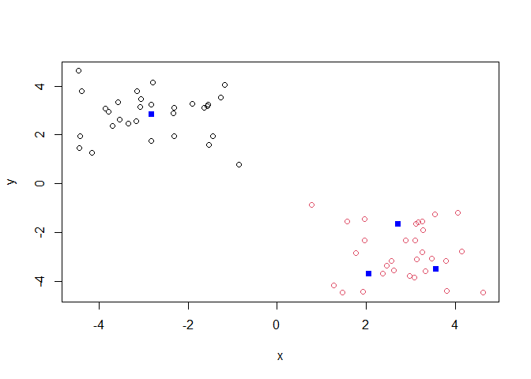

Q. Run kmeans with centers = 1-6

``` r
# run kmeans
within_ss <- NULL
for (n_centers in 1:6){
  ki = kmeans(data, centers = n_centers)
  within_ss[n_centers] <- ki$tot.withinss
}

# plot
plot(1:6, within_ss, type='b')
```

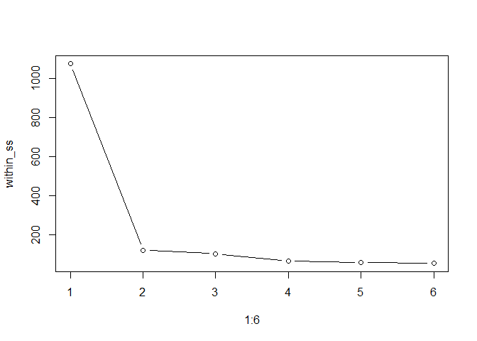

the inflection/“elbow” point here can be use to determine the
appropriate number of clusters.

### Hierarchical Clustering

run hierarchical clustering

``` r
# compute distances between points
distance <-dist(data)

# cluster
hc <- hclust(distance)
hc
```


    Call:
    hclust(d = distance)

    Cluster method   : complete 
    Distance         : euclidean 
    Number of objects: 60 

``` r
# plot results
plot(hc)
abline(h=7, col='red')
```

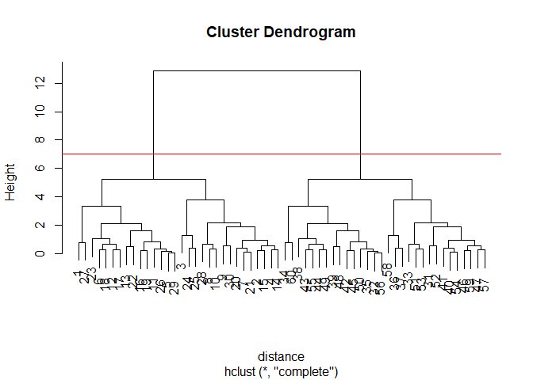

Cut the tree at threshold

``` r
grps <- cutree(hc, h=7)
grps
```

     [1] 1 1 1 1 1 1 1 1 1 1 1 1 1 1 1 1 1 1 1 1 1 1 1 1 1 1 1 1 1 1 2 2 2 2 2 2 2 2
    [39] 2 2 2 2 2 2 2 2 2 2 2 2 2 2 2 2 2 2 2 2 2 2

``` r
# plot clustering results (scatter colored by group)
plot(data, col=grps)
```

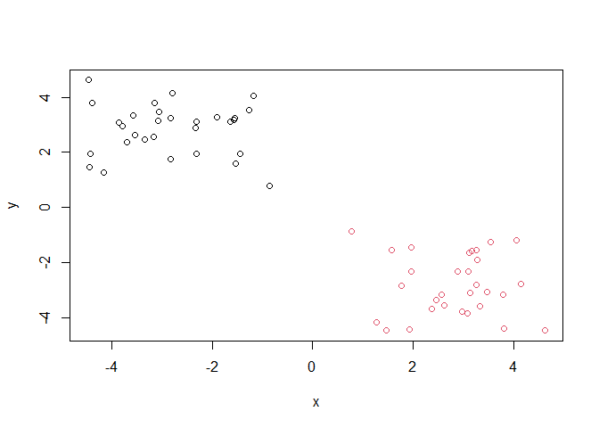

## 1. PCA of UK food data

Next, we’ll work with the UK-foods dataset

``` r
# import data
url <- "https://tinyurl.com/UK-foods"
x <- read.csv(url)

# print size and data
print(dim(x))
```

    [1] 17  5

``` r
x
```

                         X England Wales Scotland N.Ireland
    1               Cheese     105   103      103        66
    2        Carcass_meat      245   227      242       267
    3          Other_meat      685   803      750       586
    4                 Fish     147   160      122        93
    5       Fats_and_oils      193   235      184       209
    6               Sugars     156   175      147       139
    7      Fresh_potatoes      720   874      566      1033
    8           Fresh_Veg      253   265      171       143
    9           Other_Veg      488   570      418       355
    10 Processed_potatoes      198   203      220       187
    11      Processed_Veg      360   365      337       334
    12        Fresh_fruit     1102  1137      957       674
    13            Cereals     1472  1582     1462      1494
    14           Beverages      57    73       53        47
    15        Soft_drinks     1374  1256     1572      1506
    16   Alcoholic_drinks      375   475      458       135
    17      Confectionery       54    64       62        41

Q1. How many rows and columns are in your new data frame named x? What R
functions could you use to answer this questions?

rows: 17 columns: 5

``` r
# reformat table
rownames(x) <- x[,1]
x <- x[,-1]
head(x)
```

                   England Wales Scotland N.Ireland
    Cheese             105   103      103        66
    Carcass_meat       245   227      242       267
    Other_meat         685   803      750       586
    Fish               147   160      122        93
    Fats_and_oils      193   235      184       209
    Sugars             156   175      147       139

``` r
x <- read.csv(url, row.names=1)
x
```

                        England Wales Scotland N.Ireland
    Cheese                  105   103      103        66
    Carcass_meat            245   227      242       267
    Other_meat              685   803      750       586
    Fish                    147   160      122        93
    Fats_and_oils           193   235      184       209
    Sugars                  156   175      147       139
    Fresh_potatoes          720   874      566      1033
    Fresh_Veg               253   265      171       143
    Other_Veg               488   570      418       355
    Processed_potatoes      198   203      220       187
    Processed_Veg           360   365      337       334
    Fresh_fruit            1102  1137      957       674
    Cereals                1472  1582     1462      1494
    Beverages                57    73       53        47
    Soft_drinks            1374  1256     1572      1506
    Alcoholic_drinks        375   475      458       135
    Confectionery            54    64       62        41

Q2. Which approach to solving the ‘row-names problem’ mentioned above do
you prefer and why? Is one approach more robust than another under
certain circumstances?

I prefer using the row.names argument because it is succinct. It is also
more robust than the other method which will cause issues if called
multiple times.

``` r
# plot bar chart with basic plotting functionality
barplot(as.matrix(x), beside=T, col=rainbow(nrow(x)))
```


``` r
# repeat with `beside=F`
barplot(as.matrix(x), beside=F, col=rainbow(nrow(x)))
```

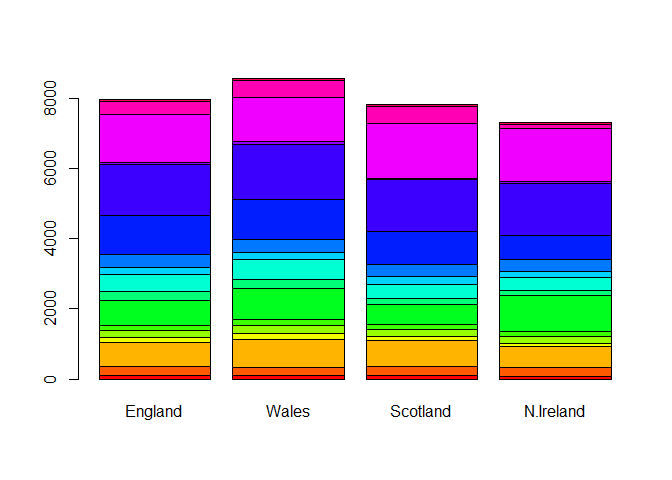

Q3: Changing what optional argument in the above barplot() function
results in the following plot? Setting `beside=F`

Convert data to long format using tidyr

``` r
library(tidyr)

# Convert data to long format for ggplot with `pivot_longer()`
x_long <- x |> 
          tibble::rownames_to_column("Food") |> 
          pivot_longer(cols = -Food, 
                       names_to = "Country", 
                       values_to = "Consumption")

print(dim(x_long))
```

    [1] 68  3

``` r
x_long
```

    # A tibble: 68 × 3
       Food            Country   Consumption
       <chr>           <chr>           <int>
     1 "Cheese"        England           105
     2 "Cheese"        Wales             103
     3 "Cheese"        Scotland          103
     4 "Cheese"        N.Ireland          66
     5 "Carcass_meat " England           245
     6 "Carcass_meat " Wales             227
     7 "Carcass_meat " Scotland          242
     8 "Carcass_meat " N.Ireland         267
     9 "Other_meat "   England           685
    10 "Other_meat "   Wales             803
    # ℹ 58 more rows

``` r
# Create grouped bar plot
library(ggplot2)

ggplot(x_long) +
  aes(x = Country, y = Consumption, fill = Food) +
  geom_col(position = "dodge") +
  theme_bw()
```

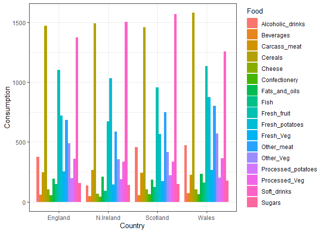

``` r
# plot stacked
ggplot(x_long) +
  aes(x = Country, y = Consumption, fill = Food) +
  geom_col() +
  theme_bw()
```

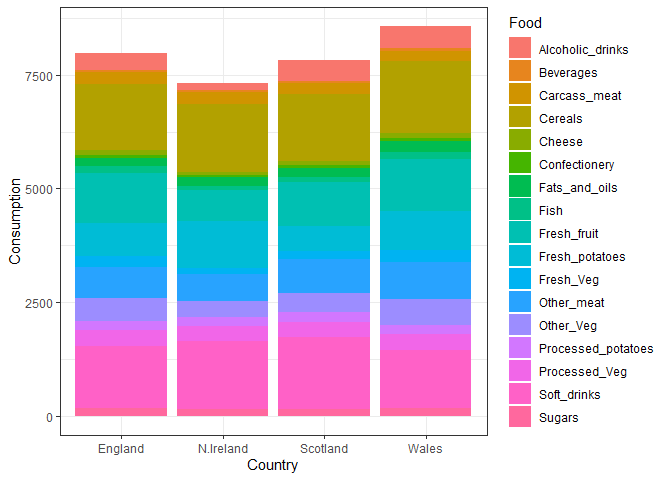

Q4: Changing what optional argument in the above ggplot() code results
in a stacked barplot figure?

removing the position = “dodge” argument

Q5: We can use the pairs() function to generate all pairwise plots for
our countries. Can you make sense of the following code and resulting
figure? What does it mean if a given point lies on the diagonal for a
given plot?

If a point falls on the diagonal, it is equal in both dimensions. Here,
it indicates the a given food is consumed equaling in two countries.

``` r
pairs(x, col=rainbow(nrow(x)), pch=16)
```


install package for heatmap plotting

``` r
# install.packages("pheatmap")
library(pheatmap)
```

Plot heatmap

``` r
pheatmap( as.matrix(x) )
```

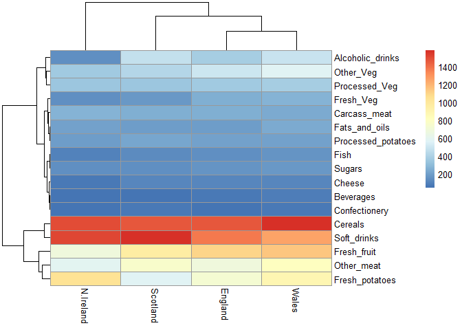

Q6. Based on the pairs and heatmap figures, which countries cluster
together and what does this suggest about their food consumption
patterns? Can you easily tell what the main differences between N.
Ireland and the other countries of the UK in terms of this data-set?

Wale and England cluster together, then these cluster with Scotland at a
higher level; while N. Ireland is the most distinct from the others.
This suggests that Wale and England have the most similar food
consumption patterns. I cannot easilly tell the main differences between
N. Ireland and the other countries of the UK. There are some foods they
seem to comsume less (e.g., alcohol, fish, cheese, fresh fruit and
veggies) and more (e.g., fresh potatoes), but no clear dramatic
differences.

Apply PCA

``` r
pca <- prcomp( t(x) )
summary(pca)
```

    Importance of components:
                                PC1      PC2      PC3       PC4
    Standard deviation     324.1502 212.7478 73.87622 3.176e-14
    Proportion of Variance   0.6744   0.2905  0.03503 0.000e+00
    Cumulative Proportion    0.6744   0.9650  1.00000 1.000e+00

Q7. Complete the code below to generate a plot of PC1 vs PC2. The second
line adds text labels over the data points.

``` r
# Create a data frame for plotting
df <- as.data.frame(pca$x)
df$Country <- rownames(df)
df
```

                     PC1         PC2        PC3           PC4   Country
    England   -144.99315   -2.532999 105.768945 -4.894696e-14   England
    Wales     -240.52915 -224.646925 -56.475555  5.700024e-13     Wales
    Scotland   -91.86934  286.081786 -44.415495 -7.460785e-13  Scotland
    N.Ireland  477.39164  -58.901862  -4.877895  2.321303e-13 N.Ireland

``` r
# Plot PC1 vs PC2 with ggplot
ggplot(pca$x) +
  aes(x = PC1, y = PC2, label = rownames(pca$x)) +
  geom_point(size = 3) +
  geom_text(vjust = -0.5) +
  xlim(-270, 500) +
  xlab("PC1") +
  ylab("PC2") +
  theme_bw()
```

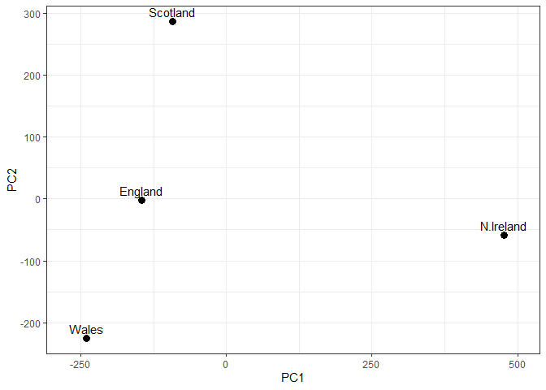

Q8. Customize your plot so that the colors of the country names match
the colors in our UK and Ireland map and table at start of this
document.

``` r
# Plot PC1 vs PC2 with ggplot
ggplot(pca$x) +
  aes(x = PC1, y = PC2, label = rownames(pca$x)) +
  geom_point(size = 3) +
  geom_text(vjust = -0.5, col=c( "yellow", "red", "blue", "green")) +
  xlim(-270, 500) +
  xlab("PC1") +
  ylab("PC2") +
  theme_bw()
```

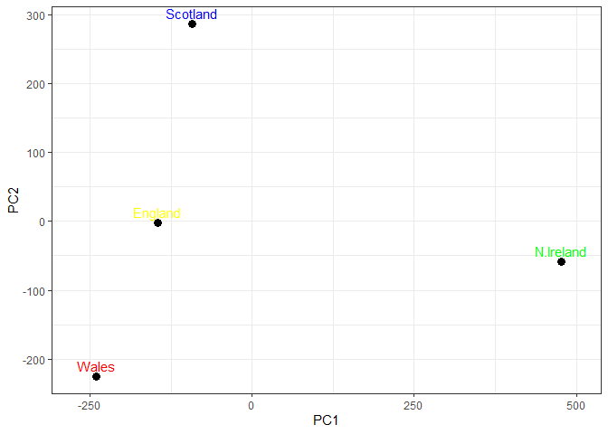

Check out variance explained by PCs

``` r
v <- round( pca$sdev^2/sum(pca$sdev^2) * 100)
v
```

    [1] 67 29  4  0

``` r
z <- summary(pca)
z$importance
```

                                 PC1       PC2      PC3          PC4
    Standard deviation     324.15019 212.74780 73.87622 3.175833e-14
    Proportion of Variance   0.67444   0.29052  0.03503 0.000000e+00
    Cumulative Proportion    0.67444   0.96497  1.00000 1.000000e+00

``` r
# Create scree plot with ggplot
variance_df <- data.frame(
  PC = factor(paste0("PC", 1:length(v)), levels = paste0("PC", 1:length(v))),
  Variance = v
)

ggplot(variance_df) +
  aes(x = PC, y = Variance) +
  geom_col(fill = "steelblue") +
  xlab("Principal Component") +
  ylab("Percent Variation") +
  theme_bw() +
  theme(axis.text.x = element_text(angle = 0))
```

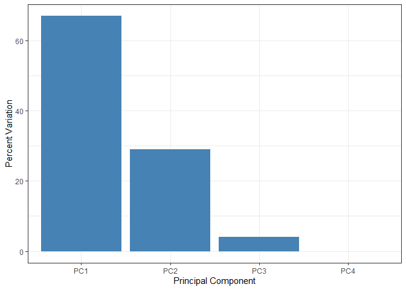

check out loadings for PC1

``` r
ggplot(pca$rotation) +
  aes(x = PC1, 
      y = reorder(rownames(pca$rotation), PC1)) +
  geom_col(fill = "steelblue") +
  xlab("PC1 Loading Score") +
  ylab("") +
  theme_bw() +
  theme(axis.text.y = element_text(size = 9))
```

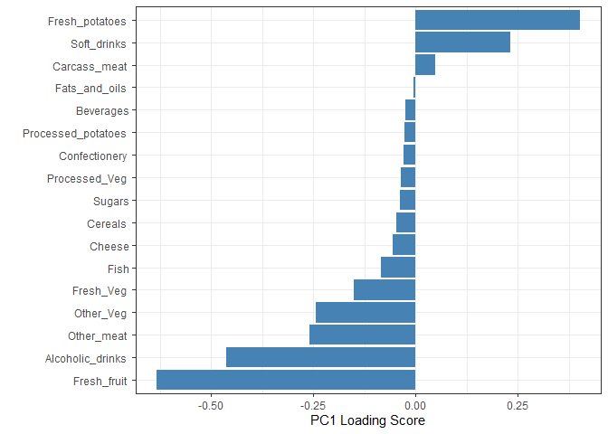

Q9: Generate a similar ‘loadings plot’ for PC2. What two food groups
feature prominantely and what does PC2 maninly tell us about?

``` r
ggplot(pca$rotation) +
  aes(x = PC2, 
      y = reorder(rownames(pca$rotation), PC1)) +
  geom_col(fill = "steelblue") +
  xlab("PC2 Loading Score") +
  ylab("") +
  theme_bw() +
  theme(axis.text.y = element_text(size = 9))
```

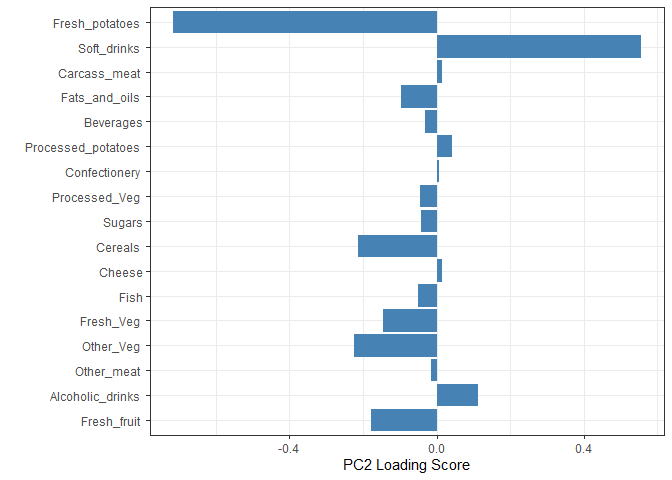

fresh potatoes and soft drinks are prominant. PC2 mainly tells us how
food consumption in Scotland, England, and Whales are different.

## 2. PCA of RNA-seq data

``` r
url2 <- "https://tinyurl.com/expression-CSV"
rna.data <- read.csv(url2, row.names=1)
head(rna.data)
```

           wt1 wt2  wt3  wt4 wt5 ko1 ko2 ko3 ko4 ko5
    gene1  439 458  408  429 420  90  88  86  90  93
    gene2  219 200  204  210 187 427 423 434 433 426
    gene3 1006 989 1030 1017 973 252 237 238 226 210
    gene4  783 792  829  856 760 849 856 835 885 894
    gene5  181 249  204  244 225 277 305 272 270 279
    gene6  460 502  491  491 493 612 594 577 618 638

Q9: How many genes and samples are in this data set? genes: 6 samples:
60 (10 per gene)

``` r
# run PCA and plot results
pca <- prcomp(t(rna.data), scale=TRUE)

# Create data frame for plotting
df <- as.data.frame(pca$x)
df$Sample <- rownames(df)

## Plot with ggplot
ggplot(df) +
  aes(x = PC1, y = PC2, label = Sample) +
  geom_point(size = 3) +
  geom_text(vjust = -0.5, size = 3) +
  xlab("PC1") +
  ylab("PC2") +
  theme_bw()
```

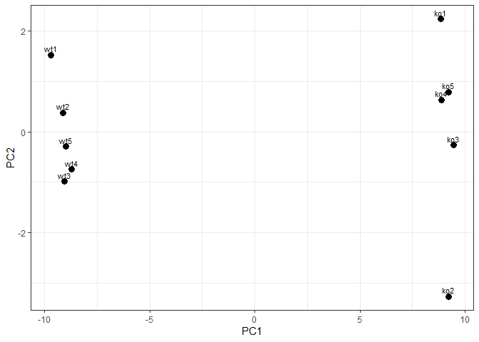

``` r
summary(pca)
```

    Importance of components:
                              PC1    PC2     PC3     PC4     PC5     PC6     PC7
    Standard deviation     9.6237 1.5198 1.05787 1.05203 0.88062 0.82545 0.80111
    Proportion of Variance 0.9262 0.0231 0.01119 0.01107 0.00775 0.00681 0.00642
    Cumulative Proportion  0.9262 0.9493 0.96045 0.97152 0.97928 0.98609 0.99251
                               PC8     PC9      PC10
    Standard deviation     0.62065 0.60342 3.344e-15
    Proportion of Variance 0.00385 0.00364 0.000e+00
    Cumulative Proportion  0.99636 1.00000 1.000e+00

``` r
# create scree plot

# Calculate variance explained
pca.var <- pca$sdev^2
pca.var.per <- round(pca.var/sum(pca.var)*100, 1)

# Create scree plot data
scree_df <- data.frame(
  PC = factor(paste0("PC", 1:10), levels = paste0("PC", 1:10)),
  Variance = pca.var[1:10]
)

ggplot(scree_df) +
  aes(x = PC, y = Variance) +
  geom_col(fill = "steelblue") +
  ggtitle("Quick scree plot") +
  xlab("Principal Component") +
  ylab("Variance") +
  theme_bw()
```

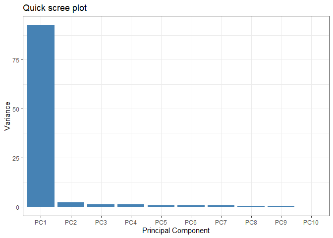

``` r
# Create percent variance scree plot
scree_pct_df <- data.frame(
  PC = factor(paste0("PC", 1:10), levels = paste0("PC", 1:10)),
  PercentVariation = pca.var.per[1:10]
)

ggplot(scree_pct_df) +
  aes(x = PC, y = PercentVariation) +
  geom_col(fill = "steelblue") +
  ggtitle("Scree Plot") +
  xlab("Principal Component") +
  ylab("Percent Variation") +
  theme_bw()
```

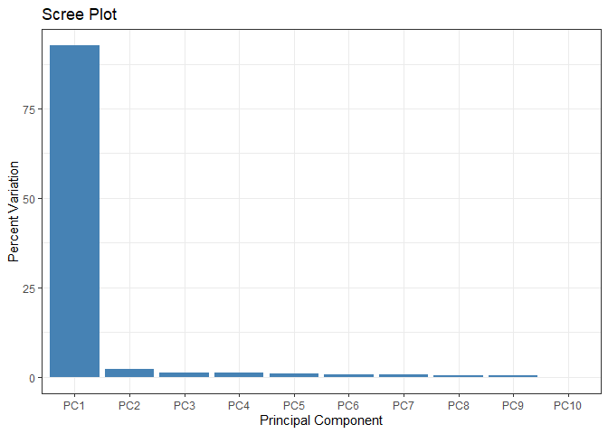

``` r
#re-plot PCA results with colors based on grouping
colvec <- colnames(rna.data)
colvec[grep("wt", colvec)] <- "red"
colvec[grep("ko", colvec)] <- "blue"

# Add condition to data frame
df$condition <- substr(df$Sample, 1, 2)
df$color <- colvec

ggplot(df) +
  aes(x = PC1, y = PC2, color = color, label = Sample) +
  geom_point(size = 3) +
  geom_text(vjust = -0.5, hjust = 0.5, show.legend = FALSE) +
  scale_color_identity() +
  xlab(paste0("PC1 (", pca.var.per[1], "%)")) +
  ylab(paste0("PC2 (", pca.var.per[2], "%)")) +
  theme_bw()
```

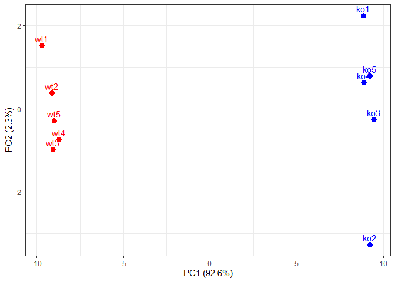

``` r
# check out loading scores

loading_scores <- pca$rotation[,1]

## Find the top 10 measurements (genes) that contribute
## most to PC1 in either direction (+ or -)
gene_scores <- abs(loading_scores) 
gene_score_ranked <- sort(gene_scores, decreasing=TRUE)

## show the names of the top 10 genes
top_10_genes <- names(gene_score_ranked[1:10])
top_10_genes 
```

     [1] "gene100" "gene66"  "gene45"  "gene68"  "gene98"  "gene60"  "gene21" 
     [8] "gene56"  "gene10"  "gene90" 
