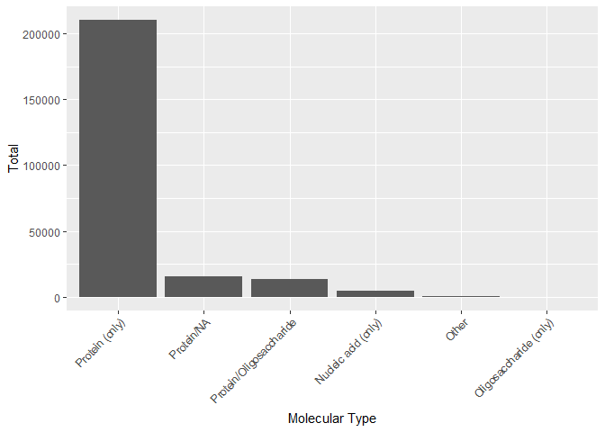
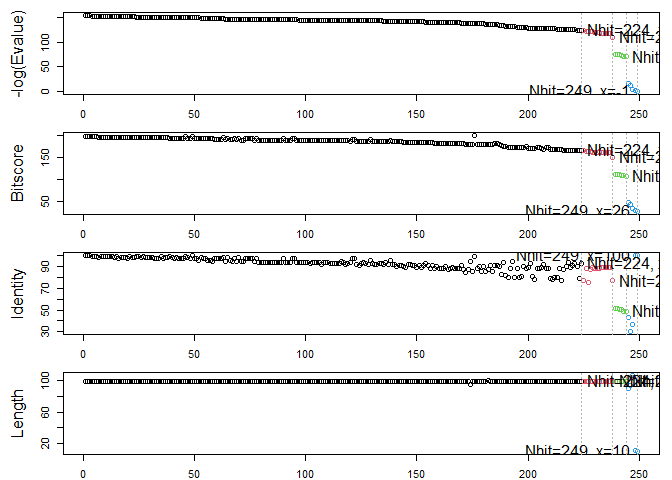
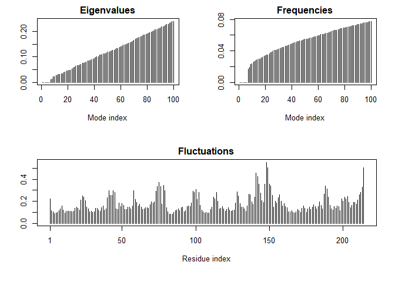
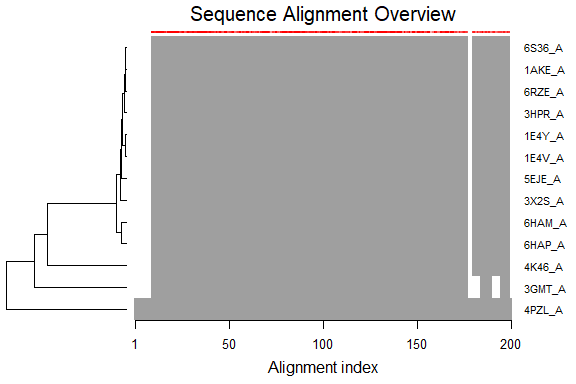
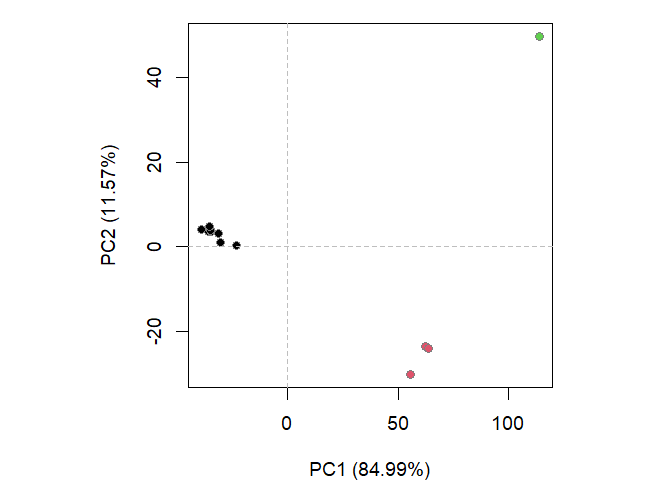
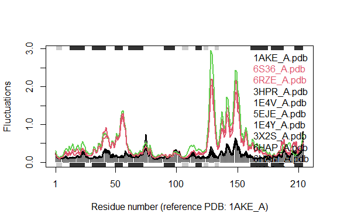

# class09
Michael Preston (PID: A53310268)

# Class 9: Structural Bioinformatics (Pt. 1)

## 1: Introduction to the RCSB Protein Data Bank (PDB)

### The PDB database

THe main repo for biomolecular structure data is the Protein Data Bank
(PDB): https://www.rcsb.org/

Analyze \> PDB Statistics \> by Experimental Method and Molecular Type

``` r
# import with basic function

data <- read.csv("Data Export Summary.csv")
head(data)
```

               Molecular.Type   X.ray     EM    NMR Integrative Multiple.methods
    1          Protein (only) 176,378 20,438 12,709         342              221
    2 Protein/Oligosaccharide  10,284  3,396     34           8               11
    3              Protein/NA   9,007  5,931    287          24                7
    4     Nucleic acid (only)   3,077    200  1,554           2               15
    5                   Other     174     13     33           3                0
    6  Oligosaccharide (only)      11      0      6           0                1
      Neutron Other   Total
    1      83    32 210,203
    2       1     0  13,734
    3       0     0  15,256
    4       3     1   4,852
    5       0     0     223
    6       0     4      22

This reads in data as ‘chr’ type because of commas. below we will use
readr package instead

``` r
# import data with readr package
library(readr)
stats <- read_csv("Data Export Summary.csv")
```

    Rows: 6 Columns: 9
    ── Column specification ────────────────────────────────────────────────────────
    Delimiter: ","
    chr (1): Molecular Type
    dbl (4): Integrative, Multiple methods, Neutron, Other
    num (4): X-ray, EM, NMR, Total

    ℹ Use `spec()` to retrieve the full column specification for this data.
    ℹ Specify the column types or set `show_col_types = FALSE` to quiet this message.

``` r
head(stats)
```

    # A tibble: 6 × 9
      `Molecular Type`    `X-ray`    EM   NMR Integrative `Multiple methods` Neutron
      <chr>                 <dbl> <dbl> <dbl>       <dbl>              <dbl>   <dbl>
    1 Protein (only)       176378 20438 12709         342                221      83
    2 Protein/Oligosacch…   10284  3396    34           8                 11       1
    3 Protein/NA             9007  5931   287          24                  7       0
    4 Nucleic acid (only)    3077   200  1554           2                 15       3
    5 Other                   174    13    33           3                  0       0
    6 Oligosaccharide (o…      11     0     6           0                  1       0
    # ℹ 2 more variables: Other <dbl>, Total <dbl>

> Q1: What percentage of structures in the PDB are solved by X-Ray and
> Electron Microscopy.

EM: 12%  
X-ray: 81%

``` r
# plot barchart of molecular types
library(ggplot2)
ggplot(stats) +
  aes(reorder(`Molecular Type`, -Total), Total) +
  geom_col() +
  theme(axis.text.x = element_text(angle = 45, hjust = 1)) +
  xlab("Molecular Type")
```



> Q2: What proportion of structures in the PDB are protein?

``` r
stats[stats$`Molecular Type`=="Protein (only)", "Total"] / sum(stats$Total)
```

         Total
    1 0.860465

Protein (only): 0.860465

> Q3: Type HIV in the PDB website search box on the home page and
> determine how many HIV-1 protease structures are in the current PDB?

4,866 structures

## 2. Visualizing the HIV-1 protease structure

The \*Mol viewer is embeded in many bioinformatics sites. The homepage
is: https://molstar.org/

Use markdown format to insert image


> Q4: Water molecules normally have 3 atoms. Why do we see just one atom
> per water molecule in this structure?

This view is only displaying the “backbone”

> Q5: There is a critical “conserved” water molecule in the binding
> site. Can you identify this water molecule? What residue number does
> this water molecule have

Residue number: 308

> Q6: Generate and save a figure clearly showing the two distinct chains
> of HIV-protease along with the ligand. You might also consider showing
> the catalytic residues ASP 25 in each chain and the critical water (we
> recommend “Ball & Stick” for these side-chains). Add this figure to
> your Quarto document.


> Q7: \[Optional\] As you have hopefully observed HIV protease is a
> homodimer (i.e. it is composed of two identical chains). With the aid
> of the graphic display can you identify secondary structure elements
> that are likely to only form in the dimer rather than the monomer?

FOOBAR

## 3. Introduction to Bio3D in R

``` r
library(bio3d)
hiv <- read.pdb("1hsg")
```

      Note: Accessing on-line PDB file

``` r
hiv
```


     Call:  read.pdb(file = "1hsg")

       Total Models#: 1
         Total Atoms#: 1686,  XYZs#: 5058  Chains#: 2  (values: A B)

         Protein Atoms#: 1514  (residues/Calpha atoms#: 198)
         Nucleic acid Atoms#: 0  (residues/phosphate atoms#: 0)

         Non-protein/nucleic Atoms#: 172  (residues: 128)
         Non-protein/nucleic resid values: [ HOH (127), MK1 (1) ]

       Protein sequence:
          PQITLWQRPLVTIKIGGQLKEALLDTGADDTVLEEMSLPGRWKPKMIGGIGGFIKVRQYD
          QILIEICGHKAIGTVLVGPTPVNIIGRNLLTQIGCTLNFPQITLWQRPLVTIKIGGQLKE
          ALLDTGADDTVLEEMSLPGRWKPKMIGGIGGFIKVRQYDQILIEICGHKAIGTVLVGPTP
          VNIIGRNLLTQIGCTLNF

    + attr: atom, xyz, seqres, helix, sheet,
            calpha, remark, call

``` r
# check out data
head(hiv$atom)
```

      type eleno elety  alt resid chain resno insert      x      y     z o     b
    1 ATOM     1     N <NA>   PRO     A     1   <NA> 29.361 39.686 5.862 1 38.10
    2 ATOM     2    CA <NA>   PRO     A     1   <NA> 30.307 38.663 5.319 1 40.62
    3 ATOM     3     C <NA>   PRO     A     1   <NA> 29.760 38.071 4.022 1 42.64
    4 ATOM     4     O <NA>   PRO     A     1   <NA> 28.600 38.302 3.676 1 43.40
    5 ATOM     5    CB <NA>   PRO     A     1   <NA> 30.508 37.541 6.342 1 37.87
    6 ATOM     6    CG <NA>   PRO     A     1   <NA> 29.296 37.591 7.162 1 38.40
      segid elesy charge
    1  <NA>     N   <NA>
    2  <NA>     C   <NA>
    3  <NA>     C   <NA>
    4  <NA>     O   <NA>
    5  <NA>     C   <NA>
    6  <NA>     C   <NA>

> Q7: How many amino acid residues are there in this pdb object?

198 amino acid residues

> Q8: Name one of the two non-protein residues?

HOH

> Q9: How many protein chains are in this structure?

2

### Blast

``` r
# run Blast on chain A sequence
# chainA <- trim.pdb(hiv, chain="A")
# chainA.seq <- pdbseq(chainA)
# blast <- blast.pdb(chainA.seq)
```

Re-run, this time caching the results

``` r
chainA <- trim.pdb(hiv, chain="A")
chainA.seq <- pdbseq(chainA)
blast <- blast.pdb(chainA.seq)
```

     Searching ... please wait (updates every 5 seconds) RID = K6TVR6M6014 
     .......
     Reporting 249 hits

``` r
head(blast$hit.tbl)
```

            queryid subjectids identity alignmentlength mismatches gapopens q.start
    1 Query_3664071     1W5V_A   100.00              99          0        0       1
    2 Query_3664071     2FDE_A   100.00              99          0        0       1
    3 Query_3664071     1AJV_A   100.00              99          0        0       1
    4 Query_3664071     2R38_A    98.99              99          1        0       1
    5 Query_3664071     2R3T_A    98.99              99          1        0       1
    6 Query_3664071     1HXB_A    98.99              99          1        0       1
      q.end s.start s.end   evalue bitscore positives mlog.evalue pdb.id    acc
    1    99      12   110 1.40e-67      199       100    153.9367 1W5V_A 1W5V_A
    2    99       2   100 1.73e-67      198       100    153.7251 2FDE_A 2FDE_A
    3    99       1    99 2.02e-67      198       100    153.5701 1AJV_A 1AJV_A
    4    99       1    99 2.55e-67      198       100    153.3371 2R38_A 2R38_A
    5    99       1    99 2.55e-67      198       100    153.3371 2R3T_A 2R3T_A
    6    99       1    99 2.55e-67      198       100    153.3371 1HXB_A 1HXB_A

``` r
# plot Blast results
hits <- plot(blast)
```

      * Possible cutoff values:    123 110 69 -2 
                Yielding Nhits:    224 238 244 249 

      * Chosen cutoff value of:    69 
                Yielding Nhits:    244 



``` r
head(hits$pdb.id)
```

    [1] "1W5V_A" "2FDE_A" "1AJV_A" "2R38_A" "2R3T_A" "1HXB_A"

### Prediction of functional motion

Normal Mode Analysis (NMA): predict large-scale
motion/flexibility/dynamics of a molecule

``` r
adk <- read.pdb("1ake")
```

      Note: Accessing on-line PDB file
       PDB has ALT records, taking A only, rm.alt=TRUE

``` r
adk_A <- trim.pdb(adk, chain='A')
adk_A
```


     Call:  trim.pdb(pdb = adk, chain = "A")

       Total Models#: 1
         Total Atoms#: 1954,  XYZs#: 5862  Chains#: 1  (values: A)

         Protein Atoms#: 1656  (residues/Calpha atoms#: 214)
         Nucleic acid Atoms#: 0  (residues/phosphate atoms#: 0)

         Non-protein/nucleic Atoms#: 298  (residues: 242)
         Non-protein/nucleic resid values: [ AP5 (1), HOH (241) ]

       Protein sequence:
          MRIILLGAPGAGKGTQAQFIMEKYGIPQISTGDMLRAAVKSGSELGKQAKDIMDAGKLVT
          DELVIALVKERIAQEDCRNGFLLDGFPRTIPQADAMKEAGINVDYVLEFDVPDELIVDRI
          VGRRVHAPSGRVYHVKFNPPKVEGKDDVTGEELTTRKDDQEETVRKRLVEYHQMTAPLIG
          YYSKEAEAGNTKYAKVDGTKPVAEVRADLEKILG

    + attr: atom, helix, sheet, seqres, xyz,
            calpha, call

``` r
m <- nma(adk_A)
```

     Building Hessian...        Done in 0.13 seconds.
     Diagonalizing Hessian...   Done in 1.57 seconds.

``` r
plot(m)
```



Let’s write out a “trajectory” of predicted motion. We’ll load this into
molstar

``` r
mktrj(m, file="adk_nma.pdb")
```

### Play with 3D viewing in R

We can use the new **“bio3dview** package, whichis not yet on CRAN, to
render integrative 3D views in R and html quarto output reports.

To install from GitHub, we can use the **pak** package.

``` r
# library(pak)
# pak::pak("bioboot/bio3dview")
# install.packages("NGLVieweR")
```

``` r
# library(bio3dview)
# view.pdb(adk)
```

This will allow us to programatically toggle visualization settings.

## 4. Comparative structure analysis of Adenylate Kinase

Install the following necessary packages in the R console:

install.packages(“bio3d”) install.packages(“devtools”)
install.packages(“BiocManager”)

BiocManager::install(“msa”)
devtools::install_bitbucket(“Grantlab/bio3d-view”)

> Q10. Which of the packages above is found only on BioConductor and not
> CRAN?

msa

> Q11. Which of the above packages is not found on BioConductor or
> CRAN?:

bio3d-view

> Q12. True or False? Functions from the devtools package can be used to
> install packages from GitHub and BitBucket?

True

### Search and retrieve ADK structures

Use function get.seq() to fetch the query sequence for chain A of the
PDB ID 1AKE

``` r
library(bio3d)
aa <- get.seq("1ake_A")
```

    Warning in get.seq("1ake_A"): Removing existing file: seqs.fasta

    Fetching... Please wait. Done.

``` r
aa
```

                 1        .         .         .         .         .         60 
    pdb|1AKE|A   MRIILLGAPGAGKGTQAQFIMEKYGIPQISTGDMLRAAVKSGSELGKQAKDIMDAGKLVT
                 1        .         .         .         .         .         60 

                61        .         .         .         .         .         120 
    pdb|1AKE|A   DELVIALVKERIAQEDCRNGFLLDGFPRTIPQADAMKEAGINVDYVLEFDVPDELIVDRI
                61        .         .         .         .         .         120 

               121        .         .         .         .         .         180 
    pdb|1AKE|A   VGRRVHAPSGRVYHVKFNPPKVEGKDDVTGEELTTRKDDQEETVRKRLVEYHQMTAPLIG
               121        .         .         .         .         .         180 

               181        .         .         .   214 
    pdb|1AKE|A   YYSKEAEAGNTKYAKVDGTKPVAEVRADLEKILG
               181        .         .         .   214 

    Call:
      read.fasta(file = outfile)

    Class:
      fasta

    Alignment dimensions:
      1 sequence rows; 214 position columns (214 non-gap, 0 gap) 

    + attr: id, ali, call

> Q13. How many amino acids are in this sequence, i.e. how long is this
> sequence?

214

Blast search the sequence. Could also use hmmer search instead

``` r
# Blast search
b <- blast.pdb(aa)
```

     Searching ... please wait (updates every 5 seconds) RID = K6TXB79W014 
     .................................
     Reporting 96 hits

``` r
# Plot a summary of search results
hits <- plot(b)
```

      * Possible cutoff values:    260 3 
                Yielding Nhits:    20 96 

      * Chosen cutoff value of:    260 
                Yielding Nhits:    20 


``` r
# List out some 'top hits'
head(hits$pdb.id)
```

    [1] "1AKE_A" "8BQF_A" "4X8M_A" "6S36_A" "9R6U_A" "9R71_A"

Shortcut above by manually setting blast results

``` r
hits <- NULL
hits$pdb.id <- c('1AKE_A','6S36_A','6RZE_A','3HPR_A','1E4V_A','5EJE_A','1E4Y_A','3X2S_A','6HAP_A','6HAM_A','4K46_A','3GMT_A','4PZL_A')
```

Use function get.pdb() and pdbslit() to fetch and parse the identified
structures.

``` r
# Download related PDB files (save locally in a new folder called "pdbs")
files <- get.pdb(hits$pdb.id, path="pdbs", split=TRUE, gzip=TRUE)
```

    Warning in get.pdb(hits$pdb.id, path = "pdbs", split = TRUE, gzip = TRUE):
    pdbs/1AKE.pdb exists. Skipping download

    Warning in get.pdb(hits$pdb.id, path = "pdbs", split = TRUE, gzip = TRUE):
    pdbs/6S36.pdb exists. Skipping download

    Warning in get.pdb(hits$pdb.id, path = "pdbs", split = TRUE, gzip = TRUE):
    pdbs/6RZE.pdb exists. Skipping download

    Warning in get.pdb(hits$pdb.id, path = "pdbs", split = TRUE, gzip = TRUE):
    pdbs/3HPR.pdb exists. Skipping download

    Warning in get.pdb(hits$pdb.id, path = "pdbs", split = TRUE, gzip = TRUE):
    pdbs/1E4V.pdb exists. Skipping download

    Warning in get.pdb(hits$pdb.id, path = "pdbs", split = TRUE, gzip = TRUE):
    pdbs/5EJE.pdb exists. Skipping download

    Warning in get.pdb(hits$pdb.id, path = "pdbs", split = TRUE, gzip = TRUE):
    pdbs/1E4Y.pdb exists. Skipping download

    Warning in get.pdb(hits$pdb.id, path = "pdbs", split = TRUE, gzip = TRUE):
    pdbs/3X2S.pdb exists. Skipping download

    Warning in get.pdb(hits$pdb.id, path = "pdbs", split = TRUE, gzip = TRUE):
    pdbs/6HAP.pdb exists. Skipping download

    Warning in get.pdb(hits$pdb.id, path = "pdbs", split = TRUE, gzip = TRUE):
    pdbs/6HAM.pdb exists. Skipping download

    Warning in get.pdb(hits$pdb.id, path = "pdbs", split = TRUE, gzip = TRUE):
    pdbs/4K46.pdb exists. Skipping download

    Warning in get.pdb(hits$pdb.id, path = "pdbs", split = TRUE, gzip = TRUE):
    pdbs/3GMT.pdb exists. Skipping download

    Warning in get.pdb(hits$pdb.id, path = "pdbs", split = TRUE, gzip = TRUE):
    pdbs/4PZL.pdb exists. Skipping download


      |                                                                            
      |                                                                      |   0%
      |                                                                            
      |=====                                                                 |   8%
      |                                                                            
      |===========                                                           |  15%
      |                                                                            
      |================                                                      |  23%
      |                                                                            
      |======================                                                |  31%
      |                                                                            
      |===========================                                           |  38%
      |                                                                            
      |================================                                      |  46%
      |                                                                            
      |======================================                                |  54%
      |                                                                            
      |===========================================                           |  62%
      |                                                                            
      |================================================                      |  69%
      |                                                                            
      |======================================================                |  77%
      |                                                                            
      |===========================================================           |  85%
      |                                                                            
      |=================================================================     |  92%
      |                                                                            
      |======================================================================| 100%

### Align and superpose structures

Use the pdbaln() function to align and also optionally fit
(i.e. superpose) the identified PDB structures.

``` r
# Align related PDBs
pdbs <- pdbaln(files, fit = TRUE, exefile="msa")
```

    Reading PDB files:
    pdbs/split_chain/1AKE_A.pdb
    pdbs/split_chain/6S36_A.pdb
    pdbs/split_chain/6RZE_A.pdb
    pdbs/split_chain/3HPR_A.pdb
    pdbs/split_chain/1E4V_A.pdb
    pdbs/split_chain/5EJE_A.pdb
    pdbs/split_chain/1E4Y_A.pdb
    pdbs/split_chain/3X2S_A.pdb
    pdbs/split_chain/6HAP_A.pdb
    pdbs/split_chain/6HAM_A.pdb
    pdbs/split_chain/4K46_A.pdb
    pdbs/split_chain/3GMT_A.pdb
    pdbs/split_chain/4PZL_A.pdb
       PDB has ALT records, taking A only, rm.alt=TRUE
    .   PDB has ALT records, taking A only, rm.alt=TRUE
    .   PDB has ALT records, taking A only, rm.alt=TRUE
    .   PDB has ALT records, taking A only, rm.alt=TRUE
    ..   PDB has ALT records, taking A only, rm.alt=TRUE
    ....   PDB has ALT records, taking A only, rm.alt=TRUE
    .   PDB has ALT records, taking A only, rm.alt=TRUE
    ...

    Extracting sequences

    pdb/seq: 1   name: pdbs/split_chain/1AKE_A.pdb 
       PDB has ALT records, taking A only, rm.alt=TRUE
    pdb/seq: 2   name: pdbs/split_chain/6S36_A.pdb 
       PDB has ALT records, taking A only, rm.alt=TRUE
    pdb/seq: 3   name: pdbs/split_chain/6RZE_A.pdb 
       PDB has ALT records, taking A only, rm.alt=TRUE
    pdb/seq: 4   name: pdbs/split_chain/3HPR_A.pdb 
       PDB has ALT records, taking A only, rm.alt=TRUE
    pdb/seq: 5   name: pdbs/split_chain/1E4V_A.pdb 
    pdb/seq: 6   name: pdbs/split_chain/5EJE_A.pdb 
       PDB has ALT records, taking A only, rm.alt=TRUE
    pdb/seq: 7   name: pdbs/split_chain/1E4Y_A.pdb 
    pdb/seq: 8   name: pdbs/split_chain/3X2S_A.pdb 
    pdb/seq: 9   name: pdbs/split_chain/6HAP_A.pdb 
    pdb/seq: 10   name: pdbs/split_chain/6HAM_A.pdb 
       PDB has ALT records, taking A only, rm.alt=TRUE
    pdb/seq: 11   name: pdbs/split_chain/4K46_A.pdb 
       PDB has ALT records, taking A only, rm.alt=TRUE
    pdb/seq: 12   name: pdbs/split_chain/3GMT_A.pdb 
    pdb/seq: 13   name: pdbs/split_chain/4PZL_A.pdb 

``` r
# Vector containing PDB codes for figure axis
ids <- basename.pdb(pdbs$id)

# Draw schematic alignment
plot(pdbs, labels=ids)
```



### Annotate collected PDB structures

``` r
anno <- pdb.annotate(ids)
unique(anno$source)
```

    [1] "Escherichia coli"                                
    [2] "Escherichia coli K-12"                           
    [3] "Escherichia coli O139:H28 str. E24377A"          
    [4] "Escherichia coli str. K-12 substr. MDS42"        
    [5] "Photobacterium profundum"                        
    [6] "Burkholderia pseudomallei 1710b"                 
    [7] "Francisella tularensis subsp. tularensis SCHU S4"

``` r
head(anno)
```

           structureId chainId macromoleculeType chainLength experimentalTechnique
    1AKE_A        1AKE       A           Protein         214                 X-ray
    6S36_A        6S36       A           Protein         214                 X-ray
    6RZE_A        6RZE       A           Protein         214                 X-ray
    3HPR_A        3HPR       A           Protein         214                 X-ray
    1E4V_A        1E4V       A           Protein         214                 X-ray
    5EJE_A        5EJE       A           Protein         214                 X-ray
           resolution       scopDomain                                        pfam
    1AKE_A       2.00 Adenylate kinase Adenylate kinase, active site lid (ADK_lid)
    6S36_A       1.60             <NA> Adenylate kinase, active site lid (ADK_lid)
    6RZE_A       1.69             <NA> Adenylate kinase, active site lid (ADK_lid)
    3HPR_A       2.00             <NA>                      Adenylate kinase (ADK)
    1E4V_A       1.85 Adenylate kinase Adenylate kinase, active site lid (ADK_lid)
    5EJE_A       1.90             <NA>                      Adenylate kinase (ADK)
                   ligandId                                       ligandName
    1AKE_A              AP5                 BIS(ADENOSINE)-5'-PENTAPHOSPHATE
    6S36_A MG (2),NA,CL (3)    MAGNESIUM ION (2),SODIUM ION,CHLORIDE ION (3)
    6RZE_A    CL (2),NA (3)                  CHLORIDE ION (2),SODIUM ION (3)
    3HPR_A              AP5                 BIS(ADENOSINE)-5'-PENTAPHOSPHATE
    1E4V_A              AP5                 BIS(ADENOSINE)-5'-PENTAPHOSPHATE
    5EJE_A           CO,AP5 COBALT (II) ION,BIS(ADENOSINE)-5'-PENTAPHOSPHATE
                                           source
    1AKE_A                       Escherichia coli
    6S36_A                       Escherichia coli
    6RZE_A                       Escherichia coli
    3HPR_A                  Escherichia coli K-12
    1E4V_A                       Escherichia coli
    5EJE_A Escherichia coli O139:H28 str. E24377A
                                                                                                                                                                         structureTitle
    1AKE_A STRUCTURE OF THE COMPLEX BETWEEN ADENYLATE KINASE FROM ESCHERICHIA COLI AND THE INHIBITOR AP5A REFINED AT 1.9 ANGSTROMS RESOLUTION: A MODEL FOR A CATALYTIC TRANSITION STATE
    6S36_A                                                                                                                   Crystal structure of E. coli Adenylate kinase R119K mutant
    6RZE_A                                                                                                                   Crystal structure of E. coli Adenylate kinase R119A mutant
    3HPR_A                                                                                               Crystal structure of V148G adenylate kinase from E. coli, in complex with Ap5A
    1E4V_A                                                                                                       Mutant G10V of adenylate kinase from E. coli, modified in the Gly-loop
    5EJE_A                                                                                  Crystal structure of E. coli Adenylate kinase G56C/T163C double mutant in complex with Ap5a
                                                        citation rObserved  rFree
    1AKE_A             Muller, C.W., et al. J Mol Biology (1992)    0.1960     NA
    6S36_A                 Rogne, P., et al. Biochemistry (2019)    0.1632 0.2356
    6RZE_A                 Rogne, P., et al. Biochemistry (2019)    0.1865 0.2350
    3HPR_A Schrank, T.P., et al. Proc Natl Acad Sci U S A (2009)    0.2100 0.2432
    1E4V_A                  Muller, C.W., et al. Proteins (1993)    0.1960     NA
    5EJE_A Kovermann, M., et al. Proc Natl Acad Sci U S A (2017)    0.1889 0.2358
            rWork spaceGroup
    1AKE_A 0.1960  P 21 2 21
    6S36_A 0.1594    C 1 2 1
    6RZE_A 0.1819    C 1 2 1
    3HPR_A 0.2062  P 21 21 2
    1E4V_A 0.1960  P 21 2 21
    5EJE_A 0.1863  P 21 2 21

### Principal component analysis

``` r
# Perform PCA
pc.xray <- pca(pdbs)
plot(pc.xray)
```


``` r
# Calculate RMSD
rd <- rmsd(pdbs)
```

    Warning in rmsd(pdbs): No indices provided, using the 204 non NA positions

``` r
# Structure-based clustering
hc.rd <- hclust(dist(rd))
grps.rd <- cutree(hc.rd, k=3)

plot(pc.xray, 1:2, col="grey50", bg=grps.rd, pch=21, cex=1)
```



``` r
mktrj(pc.xray, file="pca_results.pdb")
```

## 6. Normal mode analysis \[optional\]

Function nma() provides normal mode analysis (NMA) on both single
structures (if given a singe PDB input object) or the complete structure
ensemble (if provided with a PDBS input object). This facilitates
characterizing and comparing flexibility profiles of related protein
structures.

``` r
# NMA of all structures
modes <- nma(pdbs)
```


    Details of Scheduled Calculation:
      ... 13 input structures 
      ... storing 606 eigenvectors for each structure 
      ... dimension of x$U.subspace: ( 612x606x13 )
      ... coordinate superposition prior to NM calculation 
      ... aligned eigenvectors (gap containing positions removed)  
      ... estimated memory usage of final 'eNMA' object: 36.9 Mb 


      |                                                                            
      |                                                                      |   0%
      |                                                                            
      |=====                                                                 |   8%
      |                                                                            
      |===========                                                           |  15%
      |                                                                            
      |================                                                      |  23%
      |                                                                            
      |======================                                                |  31%
      |                                                                            
      |===========================                                           |  38%
      |                                                                            
      |================================                                      |  46%
      |                                                                            
      |======================================                                |  54%
      |                                                                            
      |===========================================                           |  62%
      |                                                                            
      |================================================                      |  69%
      |                                                                            
      |======================================================                |  77%
      |                                                                            
      |===========================================================           |  85%
      |                                                                            
      |=================================================================     |  92%
      |                                                                            
      |======================================================================| 100%

``` r
plot(modes, pdbs, col=grps.rd)
```

    Extracting SSE from pdbs$sse attribute



> Q14. What do you note about this plot? Are the black and colored lines
> similar or different? Where do you think they differ most and why?

Collectively these results indicate the existence of two major distinct
conformational states for Adk. These differ by a collective low
frequency displacement of two nucleotide-binding site regions that
display distinct flexibilities upon nucleotide binding.
