# class10
Michael Preston (PID: A53310268)

## Class 10: Halloween Mini-Project

Exploratory Analysis of Halloween Candy

## 1. Importing candy data

``` r
#candy = read.csv("candy-data.csv", row.names=1)
library(readr)
# read in data and set column names
candy = read_csv("candy-data.csv", show_col_types = FALSE)
candy <- as.data.frame(candy)
rownames(candy) <- candy[[1]]
candy <- candy[, -1]
head(candy)
```

                 chocolate fruity caramel peanutyalmondy nougat crispedricewafer
    100 Grand            1      0       1              0      0                1
    3 Musketeers         1      0       0              0      1                0
    One dime             0      0       0              0      0                0
    One quarter          0      0       0              0      0                0
    Air Heads            0      1       0              0      0                0
    Almond Joy           1      0       0              1      0                0
                 hard bar pluribus sugarpercent pricepercent winpercent
    100 Grand       0   1        0        0.732        0.860   66.97173
    3 Musketeers    0   1        0        0.604        0.511   67.60294
    One dime        0   0        0        0.011        0.116   32.26109
    One quarter     0   0        0        0.011        0.511   46.11650
    Air Heads       0   0        0        0.906        0.511   52.34146
    Almond Joy      0   1        0        0.465        0.767   50.34755

``` r
# flextable allows for scrollable table in rendered doc
flextable::flextable(head(candy))
```


``` r
library(dplyr)
```


    Attaching package: 'dplyr'

    The following objects are masked from 'package:stats':

        filter, lag

    The following objects are masked from 'package:base':

        intersect, setdiff, setequal, union

Alternative way to run functions with ‘pipe’ in dplyr. This can be more
readable for multi-step operations

``` r
candy |> select(winpercent) |> sum()
```

    [1] 4276.925

> Q1. How many different candy types are in this dataset?

There are 85 different candy types

> Q2. How many fruity candy types are in the dataset?

There are 38 fruity candy types

## 2. What is your favorate candy?

> Q3. What is your favorite candy in the dataset and what is it’s
> winpercent value?

Reese’s Peanut Butter cup: 84

> Q4. What is the winpercent value for “Kit Kat”?

77

> Q5. What is the winpercent value for “Tootsie Roll Snack Bars”?

50

try out skimr package

``` r
library("skimr")
skim(candy)
```

|                                                  |       |
|:-------------------------------------------------|:------|
| Name                                             | candy |
| Number of rows                                   | 85    |
| Number of columns                                | 12    |
| \_\_\_\_\_\_\_\_\_\_\_\_\_\_\_\_\_\_\_\_\_\_\_   |       |
| Column type frequency:                           |       |
| numeric                                          | 12    |
| \_\_\_\_\_\_\_\_\_\_\_\_\_\_\_\_\_\_\_\_\_\_\_\_ |       |
| Group variables                                  | None  |

Data summary

**Variable type: numeric**

| skim_variable | n_missing | complete_rate | mean | sd | p0 | p25 | p50 | p75 | p100 | hist |
|:---|---:|---:|---:|---:|---:|---:|---:|---:|---:|:---|
| chocolate | 0 | 1 | 0.44 | 0.50 | 0.00 | 0.00 | 0.00 | 1.00 | 1.00 | ▇▁▁▁▆ |
| fruity | 0 | 1 | 0.45 | 0.50 | 0.00 | 0.00 | 0.00 | 1.00 | 1.00 | ▇▁▁▁▆ |
| caramel | 0 | 1 | 0.16 | 0.37 | 0.00 | 0.00 | 0.00 | 0.00 | 1.00 | ▇▁▁▁▂ |
| peanutyalmondy | 0 | 1 | 0.16 | 0.37 | 0.00 | 0.00 | 0.00 | 0.00 | 1.00 | ▇▁▁▁▂ |
| nougat | 0 | 1 | 0.08 | 0.28 | 0.00 | 0.00 | 0.00 | 0.00 | 1.00 | ▇▁▁▁▁ |
| crispedricewafer | 0 | 1 | 0.08 | 0.28 | 0.00 | 0.00 | 0.00 | 0.00 | 1.00 | ▇▁▁▁▁ |
| hard | 0 | 1 | 0.18 | 0.38 | 0.00 | 0.00 | 0.00 | 0.00 | 1.00 | ▇▁▁▁▂ |
| bar | 0 | 1 | 0.25 | 0.43 | 0.00 | 0.00 | 0.00 | 0.00 | 1.00 | ▇▁▁▁▂ |
| pluribus | 0 | 1 | 0.52 | 0.50 | 0.00 | 0.00 | 1.00 | 1.00 | 1.00 | ▇▁▁▁▇ |
| sugarpercent | 0 | 1 | 0.48 | 0.28 | 0.01 | 0.22 | 0.47 | 0.73 | 0.99 | ▇▇▇▇▆ |
| pricepercent | 0 | 1 | 0.47 | 0.29 | 0.01 | 0.26 | 0.47 | 0.65 | 0.98 | ▇▇▇▇▆ |
| winpercent | 0 | 1 | 50.32 | 14.71 | 22.45 | 39.14 | 47.83 | 59.86 | 84.18 | ▃▇▆▅▂ |

> Q6. Is there any variable/column that looks to be on a different scale
> to the majority of the other columns in the dataset?

winpercent

> Q7. What do you think a zero and one represent for the
> candy\$chocolate column?

Logical/booleen indicator of whether the candy contains chocolate.

> Q8. Plot a histogram of winpercent values

``` r
library("ggplot2")
ggplot(candy, aes(x = winpercent)) +
  geom_histogram(aes(y = after_stat(density))) +
  geom_density()
```

    `stat_bin()` using `bins = 30`. Pick better value `binwidth`.

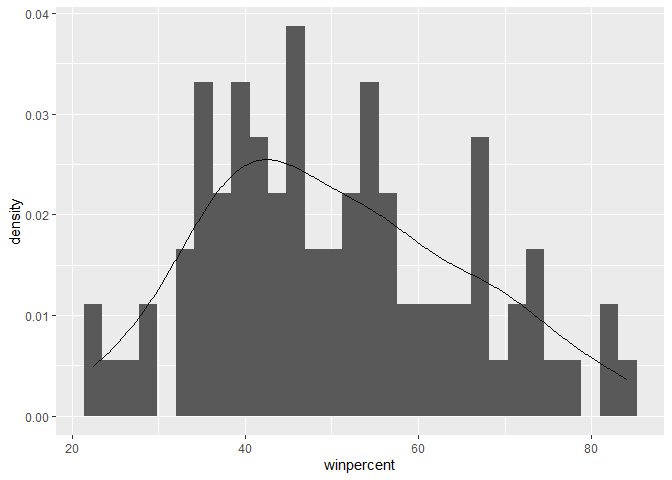

> Q9. Is the distribution of winpercent values symmetrical?

Somewhat right skewed

> Q10. Is the center of the distribution above or below 50%?

The median is below, while the mean is slightly above.

mean: 50.3167638 median: 47.829754

> Q11. On average is chocolate candy higher or lower ranked than fruit
> candy?

Higher

``` r
mean(candy[candy$fruity==1,]$winpercent)
```

    [1] 44.11974

``` r
mean(candy[candy$chocolate==1,]$winpercent)
```

    [1] 60.92153

> Q12. Is this difference statistically significant?

Yes

``` r
t.test(candy[candy$fruity==1,]$winpercent, candy[candy$chocolate==1,]$winpercent)
```


        Welch Two Sample t-test

    data:  candy[candy$fruity == 1, ]$winpercent and candy[candy$chocolate == 1, ]$winpercent
    t = -6.2582, df = 68.882, p-value = 2.871e-08
    alternative hypothesis: true difference in means is not equal to 0
    95 percent confidence interval:
     -22.15795 -11.44563
    sample estimates:
    mean of x mean of y 
     44.11974  60.92153 

## 3. Overall Candy Rankings

> Q13. What are the five least liked candy types in this set?

Nik L Nip, Boston Baked Beans, Chiclets, Super Bubble, and Jawbusters

``` r
candy |> arrange(winpercent) |> head(5)
```

                       chocolate fruity caramel peanutyalmondy nougat
    Nik L Nip                  0      1       0              0      0
    Boston Baked Beans         0      0       0              1      0
    Chiclets                   0      1       0              0      0
    Super Bubble               0      1       0              0      0
    Jawbusters                 0      1       0              0      0
                       crispedricewafer hard bar pluribus sugarpercent pricepercent
    Nik L Nip                         0    0   0        1        0.197        0.976
    Boston Baked Beans                0    0   0        1        0.313        0.511
    Chiclets                          0    0   0        1        0.046        0.325
    Super Bubble                      0    0   0        0        0.162        0.116
    Jawbusters                        0    1   0        1        0.093        0.511
                       winpercent
    Nik L Nip            22.44534
    Boston Baked Beans   23.41782
    Chiclets             24.52499
    Super Bubble         27.30386
    Jawbusters           28.12744

> Q14. What are the top 5 all time favorite candy types out of this set?

Reese’s Peanut Butter cup, Reese’s Miniatures, Twix, Kit Kat, and
Snickers.

``` r
candy |> arrange(winpercent) |> tail(5)
```

                              chocolate fruity caramel peanutyalmondy nougat
    Snickers                          1      0       1              1      1
    Kit Kat                           1      0       0              0      0
    Twix                              1      0       1              0      0
    Reese's Miniatures                1      0       0              1      0
    Reese's Peanut Butter cup         1      0       0              1      0
                              crispedricewafer hard bar pluribus sugarpercent
    Snickers                                 0    0   1        0        0.546
    Kit Kat                                  1    0   1        0        0.313
    Twix                                     1    0   1        0        0.546
    Reese's Miniatures                       0    0   0        0        0.034
    Reese's Peanut Butter cup                0    0   0        0        0.720
                              pricepercent winpercent
    Snickers                         0.651   76.67378
    Kit Kat                          0.511   76.76860
    Twix                             0.906   81.64291
    Reese's Miniatures               0.279   81.86626
    Reese's Peanut Butter cup        0.651   84.18029

> Q15. Make a first barplot of candy ranking based on winpercent values.

``` r
ggplot(candy) + 
  aes(winpercent, reorder(rownames(candy), winpercent)) + 
  geom_col() +
  ylab('Candy name') +
  xlab('Win percentage')
```

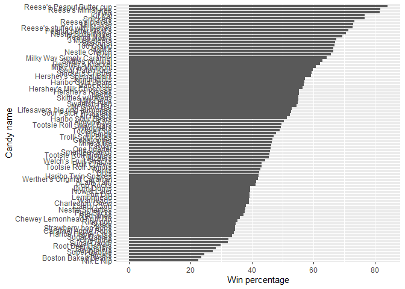

#### Time to add some useful color

``` r
my_cols=rep("black", nrow(candy))
my_cols[as.logical(candy$chocolate)] = "chocolate"
my_cols[as.logical(candy$bar)] = "brown"
my_cols[as.logical(candy$fruity)] = "pink"

ggplot(candy) + 
  aes(winpercent, reorder(rownames(candy), winpercent)) + 
  geom_col(fill=my_cols) +
  ylab('Candy name') +
  xlab('Win percentage')
```

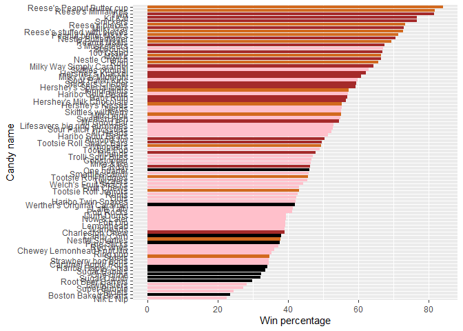

> Q17. What is the worst ranked chocolate candy?

Sixlets

> Q18. What is the best ranked fruity candy?

Starburst

``` r
temp <- arrange(candy[as.logical(candy$fruity),], winpercent)
rownames(temp)[nrow(temp)]
```

    [1] "Starburst"

## 4. Taking a look at pricepercent

``` r
library(ggrepel)

# How about a plot of price vs win
ggplot(candy) +
  aes(winpercent, pricepercent, label=rownames(candy)) +
  geom_point(col=my_cols) + 
  geom_text_repel(col=my_cols, size=3.3, max.overlaps = 20)
```

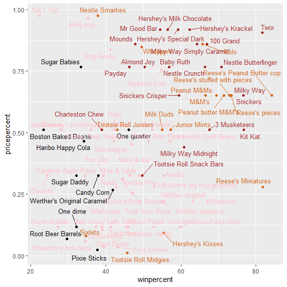

> Q19. Which candy type is the highest ranked in terms of winpercent for
> the least money - i.e. offers the most bang for your buck?

Reeses Miniatures is a good balance

> Q20. What are the top 5 most expensive candy types in the dataset and
> of these which is the least popular?

5 most expensive candy types: “Nik L Nip”, “Nestle Smarties”, “Ring
pop”, “Hershey’s Krackel”, “Hershey’s Milk Chocolate”

Least popular: Nik L Nip

``` r
ord <- order(candy$pricepercent, decreasing = TRUE)
head( candy[ord,], n=5 )
```

                             chocolate fruity caramel peanutyalmondy nougat
    Nik L Nip                        0      1       0              0      0
    Nestle Smarties                  1      0       0              0      0
    Ring pop                         0      1       0              0      0
    Hershey's Krackel                1      0       0              0      0
    Hershey's Milk Chocolate         1      0       0              0      0
                             crispedricewafer hard bar pluribus sugarpercent
    Nik L Nip                               0    0   0        1        0.197
    Nestle Smarties                         0    0   0        1        0.267
    Ring pop                                0    1   0        0        0.732
    Hershey's Krackel                       1    0   1        0        0.430
    Hershey's Milk Chocolate                0    0   1        0        0.430
                             pricepercent winpercent
    Nik L Nip                       0.976   22.44534
    Nestle Smarties                 0.976   37.88719
    Ring pop                        0.965   35.29076
    Hershey's Krackel               0.918   62.28448
    Hershey's Milk Chocolate        0.918   56.49050

> Q21. Make a barplot again with geom_col() this time using pricepercent
> and then improve this step by step, first ordering the x-axis by value
> and finally making a so called “dot chat” or “lollipop” chart by
> swapping geom_col() for geom_point() + geom_segment()

``` r
ggplot(candy) + 
  aes(pricepercent, reorder(rownames(candy), pricepercent)) + 
  geom_col() +
  ylab('Candy name') +
  xlab('Price percentage')
```

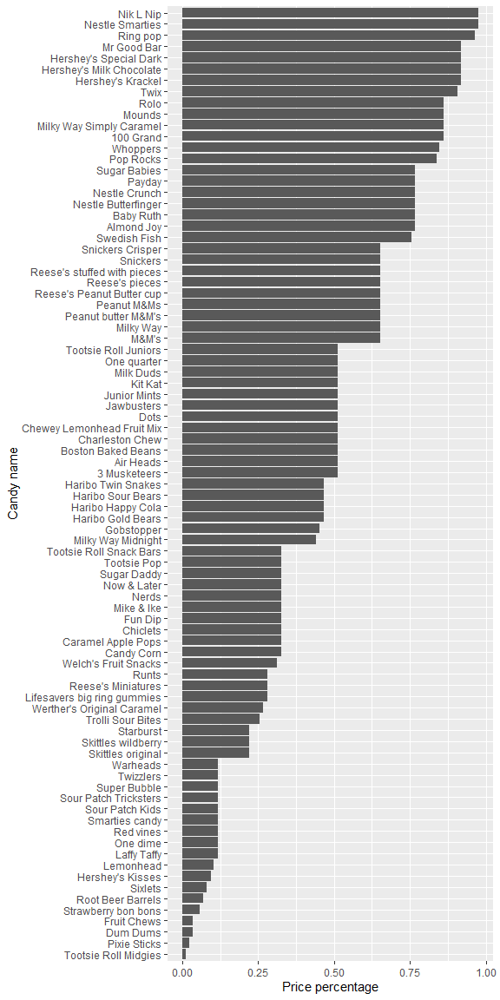

``` r
# Make a lollipop chart of pricepercent
ggplot(candy) +
  aes(pricepercent, reorder(rownames(candy), pricepercent)) +
  geom_segment(aes(yend = reorder(rownames(candy), pricepercent), 
                   xend = 0), col=my_cols) +
  geom_point()
```

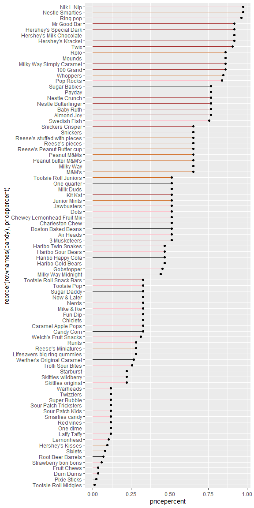

## 5 Exploring the correlation structure

``` r
library(corrplot)
```

    corrplot 0.95 loaded

``` r
cij <- cor(candy)
corrplot(cij)
```

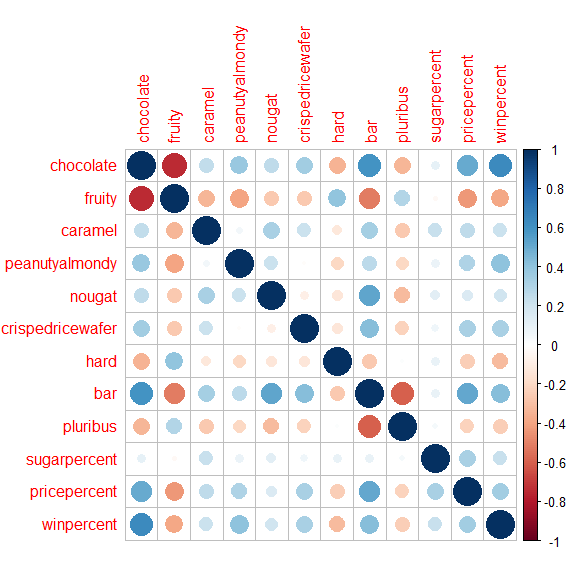

> Q22. Examining this plot what two variables are anti-correlated
> (i.e. have minus values)?

Chocolate and Fruity have the greatest negative correlation.

> Q23. Similarly, what two variables are most positively correlated?

winpercent and chocolate

## 6. Principal Component Analysis

``` r
# Define plotting functions for PCA results

plot_pca_scatter12 <- function(pca){
  # Plot "PC Plot" / "score plot" i.e. scatterplot of PC1 v. PC2
  ggplot(pca$x) +
    aes(x = PC1, y = PC2) +
    geom_point()
}

plot_pca_scree <- function(pca){
  # Create scree plot

  # Compute variance explained
  v <- round(pca$sdev^2/sum(pca$sdev^2) * 100)
  variance_df <- data.frame(
    PC = factor(paste0("PC", 1:length(v)), levels = paste0("PC", 1:length(v))),
    Variance = v
  )
  
  # Plot
  ggplot(variance_df) +
  aes(x = PC, y = Variance) +
  geom_col(fill = "steelblue") +
  xlab("Principal component") +
  ylab("Percent variation") +
  theme_bw() +
  theme(axis.text.x = element_text(angle = 0))
}

plot_pca_loading <- function(pca){
  # plot PCA loadings
  ggplot(pca$rotation) +
  aes(x = PC1,
  y = reorder(rownames(pca$rotation), PC1)) +
  geom_col(fill = "steelblue") +
  xlab("PC1 Loading Score") +
  ylab("") +
  theme_bw() +
  theme(axis.text.y = element_text(size = 9))
}

plot_pca_results <- function(pca){
  print(plot_pca_scatter12(pca))
  print(plot_pca_scree(pca))
  print(plot_pca_loading(pca))
}
```

``` r
# Perform PCA and show results
candy.pca <- prcomp(candy, scale=T)
summary(candy.pca)
```

    Importance of components:
                              PC1    PC2    PC3     PC4    PC5     PC6     PC7
    Standard deviation     2.0788 1.1378 1.1092 1.07533 0.9518 0.81923 0.81530
    Proportion of Variance 0.3601 0.1079 0.1025 0.09636 0.0755 0.05593 0.05539
    Cumulative Proportion  0.3601 0.4680 0.5705 0.66688 0.7424 0.79830 0.85369
                               PC8     PC9    PC10    PC11    PC12
    Standard deviation     0.74530 0.67824 0.62349 0.43974 0.39760
    Proportion of Variance 0.04629 0.03833 0.03239 0.01611 0.01317
    Cumulative Proportion  0.89998 0.93832 0.97071 0.98683 1.00000

``` r
plot_pca_results(candy.pca)
```

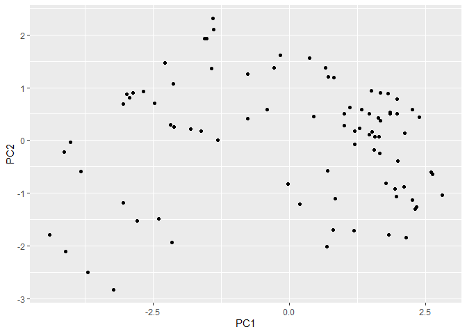

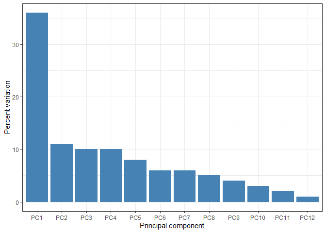

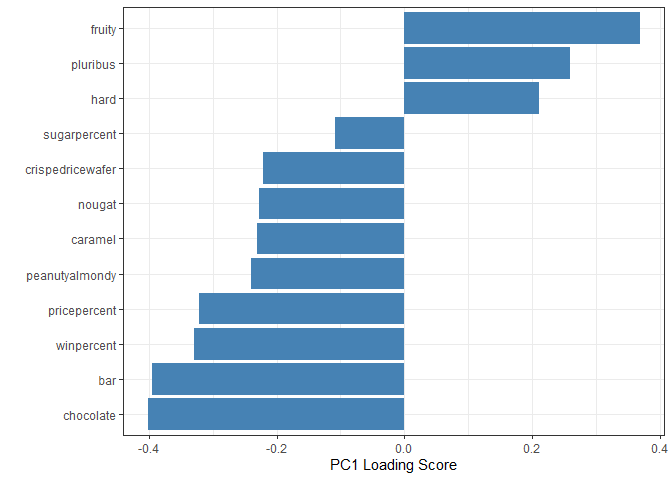

``` r
# repeat, plotting size based on winpercent

# Make a new data-frame with our PCA results and candy data
my_data <- cbind(candy, candy.pca$x[,1:3])

# plot
p <- ggplot(my_data) + 
        aes(x=PC1, y=PC2, 
            size=winpercent/100,  
            text=rownames(my_data),
            label=rownames(my_data)) +
        geom_point(col=my_cols)

p
```

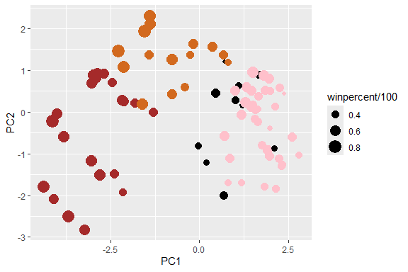

Use ggrepel package and the function ggrepel::geom_text_repel() to label
up the plot with non overlapping candy names

``` r
p + geom_text_repel(size=3.3, col=my_cols, max.overlaps = 30)  + 
  theme(legend.position = "none") +
  labs(title="Halloween Candy PCA Space",
       subtitle="Colored by type: chocolate bar (dark brown), chocolate other (light brown), fruity (red), other (black)",
       caption="Data from 538")
```

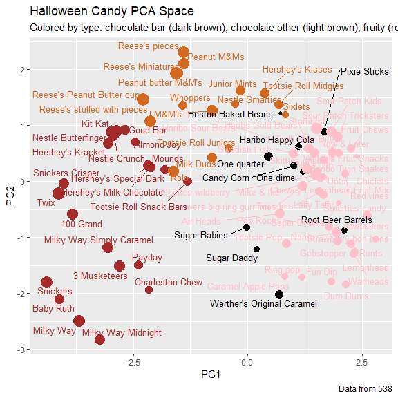

One more plotting option with gploty. This is an interactive plot, so
you can get info on each data point by hovering the mouse over it

``` r
# library(plotly)
# ggplotly(p)
```

Check out loadings

``` r
par(mar=c(8,4,2,2))
barplot(candy.pca$rotation[,1], las=2, ylab="PC1 Contribution")
```


> Q24. What original variables are picked up strongly by PC1 in the
> positive direction? Do these make sense to you?

Fruity, hard, and pluribus. Yes, these features describe the candies
with the highest values along PC1 (e.g., skittles, warheads, lemonheads)
